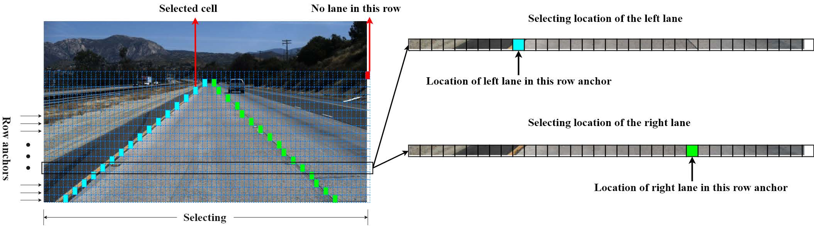

# Ultra-Fast-Lane-Detection
The implementation of the paper "[Ultra Fast Structure-aware Deep Lane Detection](https://arxiv.org/abs/2004.11757)".

Updates: Our paper has been accepted by ECCV2020.



The evaluation code is modified from [SCNN](https://github.com/XingangPan/SCNN) and [Tusimple Benchmark](https://github.com/TuSimple/tusimple-benchmark).

Caffe model and prototxt can be found [here](https://github.com/Jade999/caffe_lane_detection).


# Install
Please see [INSTALL.md](./INSTALL.md)

# quick usage
1. convert video into images and list txt file

    ```Shell
    python3 mp4tolist.py
    ```
    
2. batch run ultra-fast-lane-detection to get NN result. you should change the correspoding path and GPU version by yourself.
    It will generate a 'line' folder saving the detected point, prob from NN.

    ```Shell
    python3 batch_demo.py
    ```

3. treat with the NN result using poly line fitting to get a score. it will generate a 'para' folder saving all points, 3 times fitting, 6 times fitting and scores

    ```Shell
    python3 lane_fit.py
    ```
    
4. you should run image mask script to get the car mask using all images from video. it should save to /vedio/img/283/mask_folder/ 
     
5.only using mask of objection(car,bike,people) and hough line method to get a pure CV result. it will save to 'cv_para' folder
    ```Shell
    python3 only_mask_obj.py
    ```


# Citation

```
@InProceedings{qin2020ultra,
author = {Qin, Zequn and Wang, Huanyu and Li, Xi},
title = {Ultra Fast Structure-aware Deep Lane Detection},
booktitle = {The European Conference on Computer Vision (ECCV)},
year = {2020}
}
```
